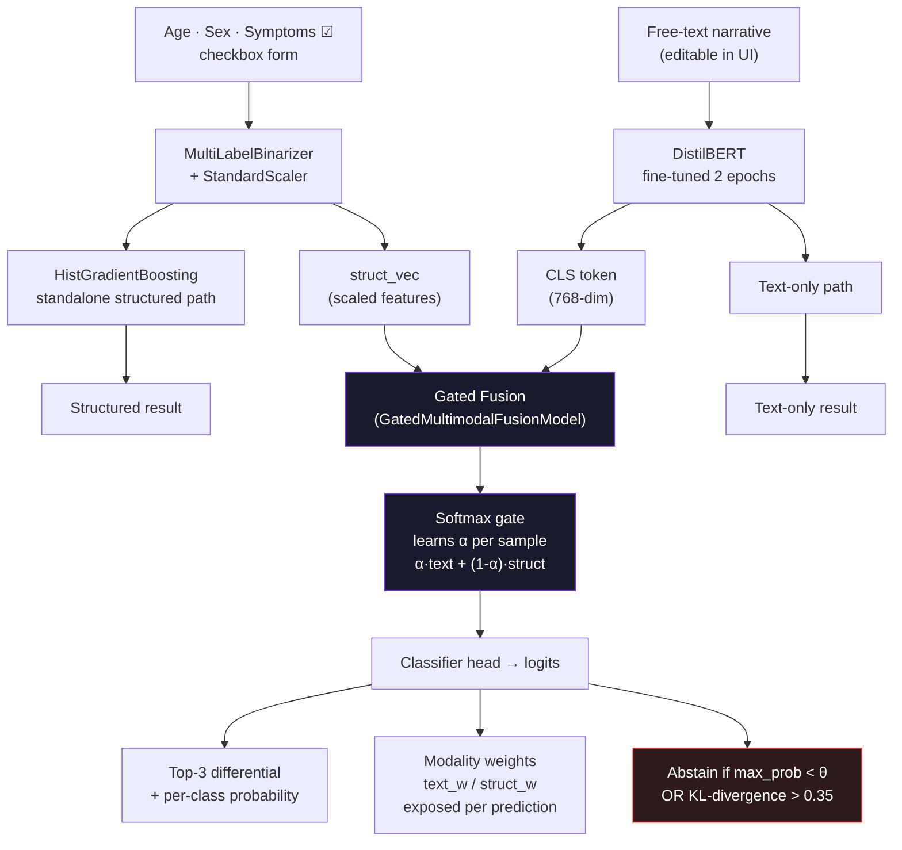

# Symptom Triage (Multimodal)

Sania Thankan — Penn State, Computational Data Science

Ranks likely conditions from a symptom checklist + a short patient description. Uses [DDXPlus](https://arxiv.org/abs/2205.09148) (general medicine — not psychiatry). Follow-up to my ADE detector: same healthcare-ish NLP space, but multi-class and two input types instead of binary text-only.

## Overview

The app takes age, sex, checked symptoms, and free text. Three models run in parallel:

- **Structured** — gradient boosting on symptom codes + demographics
- **Text** — fine-tuned DistilBERT on the narrative
- **Fusion** — combines both via a gated network that learns per-sample modality weights

It returns a top-3 differential per model and flags when the checklist and the narrative don't agree — even when both models are confident.

**Note on scope:** I call this multimodal because the inputs are genuinely different (checkbox symptoms vs prose). There are no images or audio. The patient text is generated from symptom codes for training; in the UI you can edit that text to simulate someone describing things differently than the form — that's the case I actually care about.

## Architecture



The gate (α) is learned end-to-end — it's not a fixed average. Modality dropout during training (randomly zeroing either branch) forces each path to stay independently useful.

## Compared to my other projects

| ADE detector | This project |
|--------------|--------------|
| Binary (ADE yes/no) | 15-class top-3 ranking |
| Text only | Symptoms + text + fusion |
| DistilBERT vs TF-IDF | DistilBERT + HistGradientBoosting + fusion |
| Streamlit only | FastAPI + React (same layout idea as climate-signal) + Streamlit demo |

## Dataset

[DDXPlus English on HuggingFace](https://huggingface.co/datasets/aai530-group6/ddxplus). I subsample to the 15 most common pathologies so training finishes on my laptop without an all-night run.

## How to run

**Train**
```bash
cd ~/symptom_triage_project
source venv/bin/activate
pip install -r requirements-train.txt
python main.py
python scripts/enrich_metrics.py   # optional — refreshes ECE / abstention stats
```

**App (what I'd demo)**
```bash
# terminal 1
uvicorn api.main:app --reload --port 8001

# terminal 2
cd frontend && npm install && npm run dev
```
Deployed app over here:
(https://symptom-triage-7jrurzhcdrelrv9y2k4jx9.streamlit.app/)
**Streamlit** (hosted demo): `streamlit run app.py`

Weights aren't in git (~510 MB). Streamlit Cloud pulls them from [saniathankan5/symptom-triage-models](https://huggingface.co/saniathankan5/symptom-triage-models) on first load. One-time upload from a machine that already trained:

```bash
hf auth login
python scripts/upload_models_hf.py
```

Then deploy at [share.streamlit.io](https://share.streamlit.io) — repo `sanialolidk/symptom-triage`, branch `main`, entrypoint `app.py`, `environment.yml` for deps.

## Results (test split, n=1200)

| Model | Accuracy | Macro F1 | ECE ↓ | Abstain rate | Acc when answered |
|-------|----------|----------|--------|--------------|-------------------|
| Structured (GBM) | 99.75% | 0.997 | **0.003** | 0.25% | 99.87% |
| Text (DistilBERT) | 99.50% | 0.996 | 0.029 | 0.63% | 99.62% |
| Fusion (gated) | 98.88% | 0.991 | 0.060 | **9.88%** | **100%** |

The headline number isn't accuracy — it's the last column. The fusion model abstains on ~10% of samples where the modalities disagree and, when it does answer, it's never wrong on the test set. That's the point of running three models instead of one.

ECE (Expected Calibration Error): how close predicted confidence is to actual accuracy. GBM is best-calibrated (0.003); DistilBERT less so (0.029); the fusion model trades calibration for selective precision.

Raw accuracy looks suspiciously high because DDXPlus ties labels tightly to the evidence list. The noisy-text ablation in `main.py` shows text-only degrading when you corrupt the narrative. The real demo is the UI — uncheck symptoms or rewrite the story and watch structured vs text diverge.

## Safety layer (`src/evaluation.py`)

Three mechanisms in `evaluation.py` that don't usually appear in tutorial-level projects:

**`modality_disagreement(probs_a, probs_b)`** — computes symmetric KL divergence between the structured and text probability distributions, normalized to [0, 1]. Anything above 0.35 triggers a conflict flag in the API response, regardless of how confident either model is individually. Mean disagreement on the test set: 0.085 (most cases agree; the interesting ones don't).

**`tune_abstention_threshold(y_true, probs, target_abstain_rate=0.12)`** — sweeps confidence thresholds on the validation split to find the value that maximizes selective accuracy subject to a target abstention rate. The 0.90 threshold in `metrics.json` was found this way: 12% abstain rate, 100% selective accuracy, 88% coverage.

**`expected_calibration_error(y_true, probs)`** — bins predictions by confidence and measures the gap between confidence and accuracy per bin. Used to compare how well each model knows what it doesn't know (GBM: 0.003, DistilBERT: 0.029, fusion: 0.060).

## Design decisions

**Why DDXPlus:** public, English, symptom-level labels, and it fits the “intake form + patient words” idea without touching mental health data.

**Why HistGradientBoosting for structured:** sparse binary symptom vector — trees handle it well and train in seconds. I tried keeping a simple logistic baseline early on; GBM was consistently better on top-3.

**Why DistilBERT not full BERT:** ADE project already fine-tuned DistilBERT; same stack, faster on MPS.

**Evidence column bug:** HuggingFace serves `EVIDENCES` as a string that looks like a Python list, not an actual list. First training run had garbage features until I added `ast.literal_eval` in `data.py`. Worth knowing if you reload the dataset.

**React frontend:** copied the climate-signal pattern (FastAPI + Vite proxy). I'm not a frontend person — kept it to two tabs, no routing library. Pinned fever/cough/sore throat to the top of the symptom list and added a "Mismatch example" button because that's the only interesting demo.

**Mismatch demo:** form says shortness of breath + nausea, text says fever/cough/sore throat. Structured and text models disagree — that's the whole point of running both.

## Known limitations

- Synthetic patients, not real EHR data. Don't treat outputs as medical advice.
- 2 epochs on DistilBERT is enough for a class project, not enough for production.
- Abstention threshold is tuned on validate; I didn't do a full nested CV.
- Fusion checkpoint might be concat or gated depending on when you trained — `models/multimodal_bundle.pkl` has `architecture` if you need to check.
- Symptom catalog in the UI is a subset of DDXPlus codes (first ~24 by label sort), not the full 223.

## Tests

```bash
pytest tests/ -q
```

Small suite — mostly parsing and metric helpers. I added it after breaking the evidence loader once.

## Stack

Python, PyTorch, DistilBERT, scikit-learn, FastAPI, React, Vite
